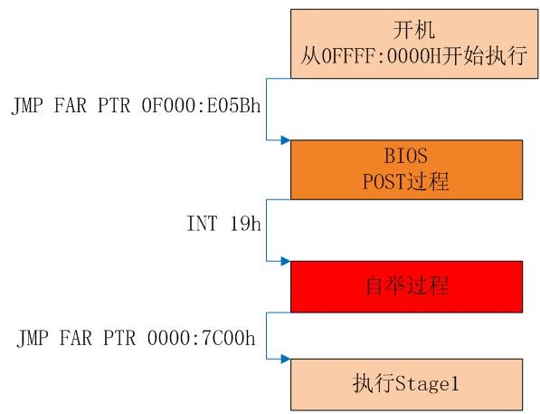

# lab1

## Part1: PC Bootstrap

### The PC's Physical Address Space

```

+------------------+  <- 0xFFFFFFFF (4GB)
|      32-bit      |
|  memory mapped   |
|     devices      |
|                  |
/\/\/\/\/\/\/\/\/\/\

/\/\/\/\/\/\/\/\/\/\
|                  |
|      Unused      |
|                  |
+------------------+  <- depends on amount of RAM
|                  |
|                  |
| Extended Memory  |
|                  |
|                  |
+------------------+  <- 0x00100000 (1MB)
|     BIOS ROM     |
+------------------+  <- 0x000F0000 (960KB)
|  16-bit devices, |
|  expansion ROMs  |
+------------------+  <- 0x000C0000 (768KB)
|   VGA Display    |
+------------------+  <- 0x000A0000 (640KB)
|                  |
|    Low Memory    |
|                  |
+------------------+  <- 0x00000000
```

最早的PC机,是基于16位的intel的8086处理器,最多只能访问1M的物理内容.早期的PC机的物理寻址范围是:` 0x00000000 ~ 0x000FFFFF`. 在上图中的640KB以下的区域被标记为"Low Memory",早期计算机只能使用这个区域内的内存.

剩下的384KB区域( 0x000A0000 到 0x000FFFFF)是保留给硬件特殊使用的,比如用做video display  buggers和 firmware held in non-volatile memory.

最重要的是保留区域是Basic Input/Output System(BIOS),总共拥有64KB大小,范围从0x000F0000 到 0x000FFFFF.早期电脑的BIOS存储在ROM,现在的BIOS存储在updateable flash memory.BIOS的主要作用是基本系统的初始化,例如激活显卡,检测内存大小.在初始化完成后,BIOS会从适当的引导盘(floppy disk,hard disk,CD0ROM 或者网络)加载操作系统,加载完后将控制权交给操作系统.


### The ROM BIOS


在对内存编址的时候，640KB到1MB的地址空间会映射到各种ROM,如960KB-1MB就直接映射到BIOS,768KB-960KB还可以映射VGA显卡BIOS等其它ROM类型的BIOS,这样就会在真正的内存中形成空洞(hole),这个区域的实际内存是没有用的,通过寻址是直接从其它ROM读取而不是从RAM中读取的,这完全由硬件实现.如果断电重启的话,RAM内存里面是没有任何东西的,不过ROM里面的程序是一直保留的,通过地址映射就可以直接读取ROM原始的系统初始化软件(BIOS),就是在操作系统内核运行之前运行的一段小软件。通过这段小软件，我们可以初始化硬件设备、建立系统的内存空间映射图，从而将系统的软硬件环境带到一个合适的状态，以便为最终调用操作系统内核准备好正确的环境。最终引导加载程序把操作系统内核映像加载到RAM中，并将系统控制权传递给它。

对于绝大多数计算机系统而言，操作系统和应用软件是存放在磁盘（硬盘/软盘）、光盘、EPROM、ROM、Flash等可在掉电后继续保存数据的存储介质上。计算机启动后，CPU一开始会到一个特定的地址开始执行指令，这个特定的地址存放了系统初始化软件，负责完成计算机基本的IO初始化，这是系统加电后运行的第一段软件代码。对于Intel 80386的体系结构而言，PC机中的系统初始化软件由BIOS (Basic Input Output System，即基本输入/输出系统，其本质是一个固化在主板Flash/CMOS上的软件)和位于软盘/硬盘引导扇区中的OS Boot Loader（在ucore中的bootasm.S和bootmain.c）一起组成。BIOS实际上是被固化在计算机ROM（只读存储器）芯片上的一个特殊的软件，为上层软件提供最底层的、最直接的硬件控制与支持。更形象地说，BIOS就是PC计算机硬件与上层软件程序之间的一个"桥梁"，负责访问和控制硬件。





**POST过程分析**

POST过程在主要步骤如下：

1. 初始化各种主板芯片组
2. 初始化键盘控制器8042
3. 初始化中断向量,中断服务例程.
4. 初始化 VGA BIOS 控制器
5. 显示BIOS的版本和公司名称
6. 扫描软驱和各种介质容量
7. 读取CMOS的启动顺序配置，并检测启动装置是否正常
8. 调用INT 19h启动自举程序

**自举过程**

自举过程即为执行中断INT19的中断服务例程INT19_VECT的过程,其主要功能为读取操作系统启动块，将其读入到内存0000:7C00h，并跳转至此处执行。

经过BIOS过程后内存的分布如下:

```
+------------------+  <- 0xFFFFFFFF (4GB)
|      32-bit      |
|  memory mapped   |
|     devices      |
|                  |
/\/\/\/\/\/\/\/\/\/\

/\/\/\/\/\/\/\/\/\/\
|                  |
|      Unused      |
|                  |
+------------------+  <- depends on amount of RAM
|                  |
|                  |
| Extended Memory  |
|                  |
|                  |
+------------------+  <- 0x00100000 (1MB)
|     BIOS ROM     |
+------------------+  <- 0x000F0000 (960KB)
|  16-bit devices, |
|  expansion ROMs  |
+------------------+  <- 0x000C0000 (768KB)
|   VGA Display    |
+------------------+  <- 0x000A0000 (640KB)
|                  |
|    Low Memory    |
|                  |
|                  |
+------------------+ <- 0x000000500
|   BIOS数据区     |
+------------------+ <- 0x00000400(1KB)
|   中断向量表     |
+------------------+ <- 0x00000000
```

## Part2: The Boot Loader


## 参考
1. [BIOS 工作原理](http://www.cnblogs.com/oo_o/p/BIOS.html)
2. [BIOS启动过程](https://objectkuan.gitbooks.io/ucore-docs/content/lab1/lab1_3_1_bios_booting.html)
3. [BIOS启动过程分析](http://blog.csdn.net/alais/article/details/5129005)
4. [BIOS启动过程简述](http://www.imsiren.com/archives/909)

